# Procedure

Download Xampp: https://www.apachefriends.org/download.html

then Install it by watching this vedio 

### Database Create
Open Xampp control panel and Click Start action of Mysql and Apache,

then both Module will be green color.

Click Admin Option Of Mysql module.
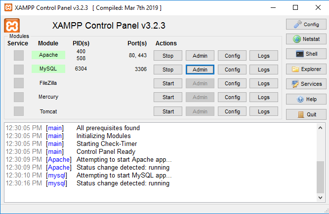

then Create a database name porosh 

and import porosh.sql file in the database.

then Run the Project 

(http://localhost/hope/index.php)

# KUET_Restaurant
## LOgin Page
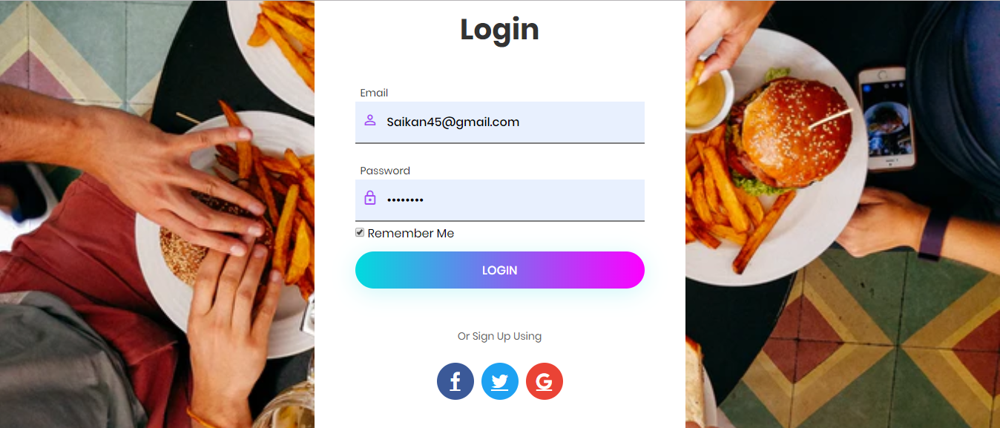
### SignUp Page

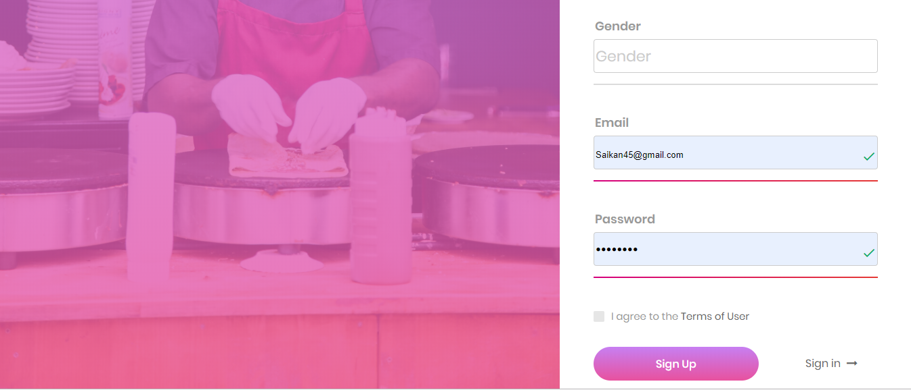

### Home Page
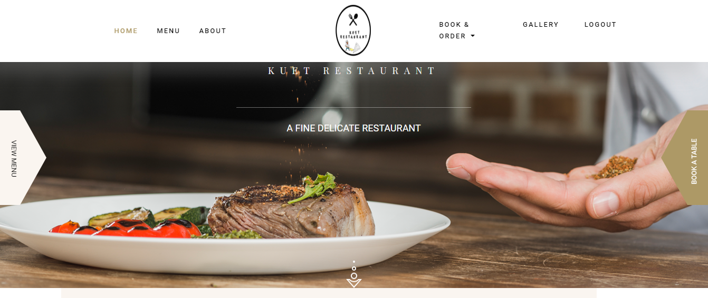
## Menu
### Chicken

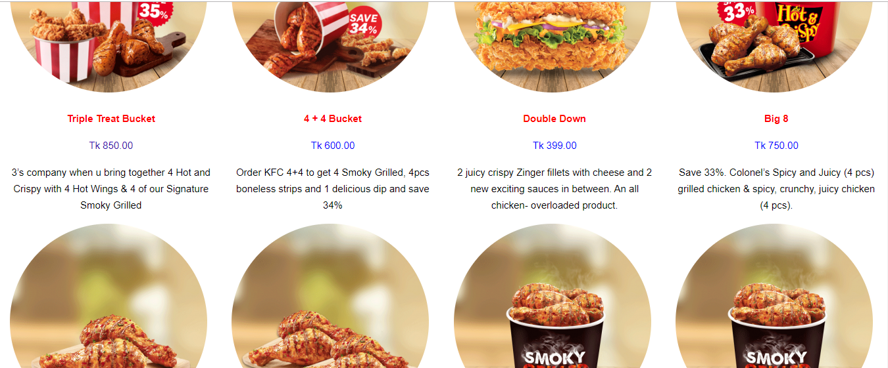
### Snacks

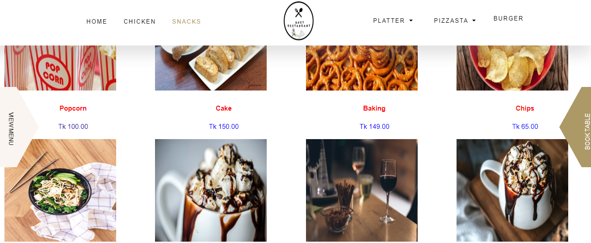
### Pizza

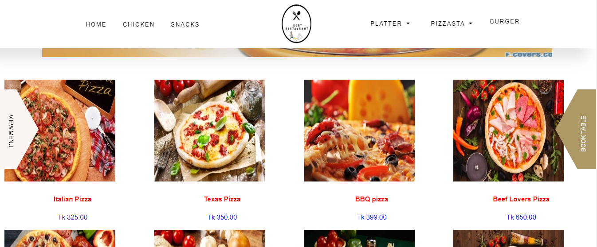
### Pasta

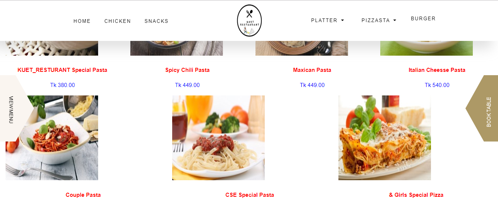
### Burger

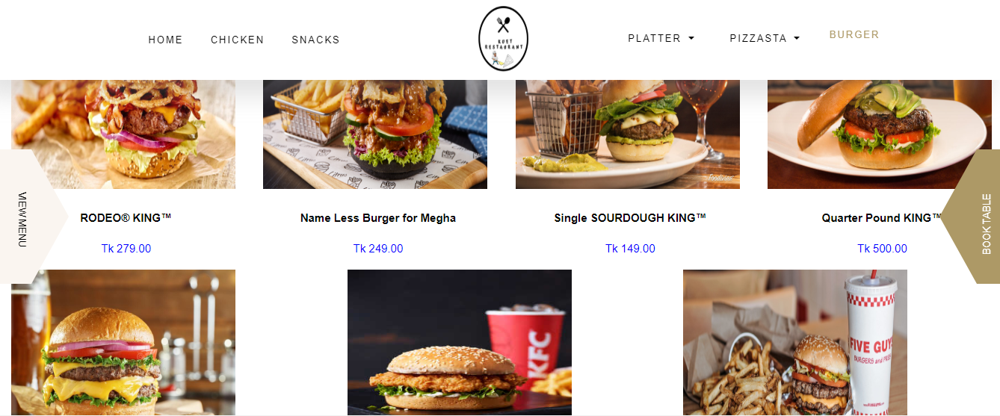
### About Developer

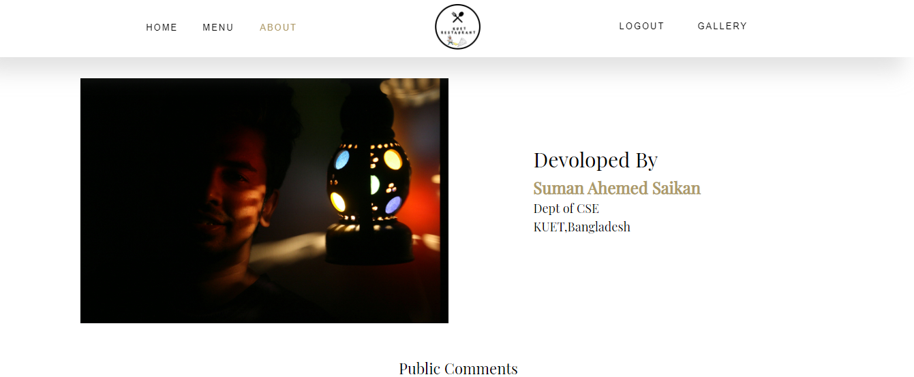
### Online Food Ordering

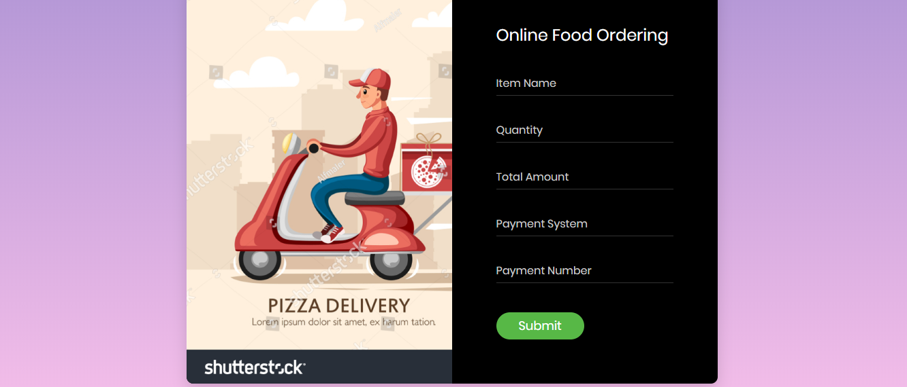
## Booking Restaurant

## Gallery
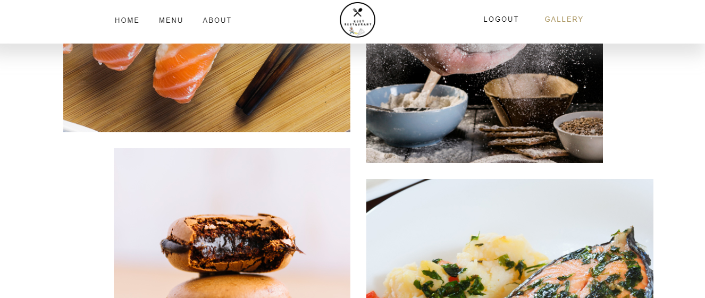

